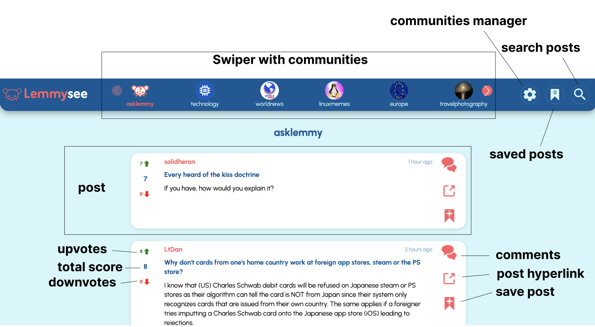

# Lemmysee

[Lemmysee](https://lemmysee.netlify.app) is a web-based application allowing users to browse posts based on communities from the Lemmy network.

>[Lemmy](https://join-lemmy.org/) is a federated, open-source social media platform where users can share, discuss, and vote on content in the form of posts, links, and comments. It’s organized into communities, which are individual hubs focused on specific topics, such as news, hobbies, entertainment, or niche interests. Each community has its own rules and moderators, allowing for diverse conversations and content tailored to its subject matter.

I built this app as a required project at the [Codecademy](https://www.codecademy.com/) learning platform. My goal was to create a cleaner version of Lemmy, where the user can only READ the content based on their preferred communities.
Therefore, the [Lemmy API](https://join-lemmy.org/docs/contributors/04-api.html) has been used to obtain data, and only GET requests are executed when using the Lemmysee app.

## Initial setup
Lemmysee can be found under this [LINK](https://lemmysee.netlify.app).
After opening the link, the application is ready to be used. The feed of popular posts is displayed initially.

## App layout
The app is structured as follows:

## Features

### Communities management
Communities displayed in the **SWIPER** can be changed depending on the user's interests. Clicking the **_COMMUNITIES MANAGER BUTTON_** launches a page with 2 sections:

#### 1. My Communities selection

* renders community boxes
* each box includes a community name, an icon (if available), a banner (if available) and 2 buttons
* the left **_info button_** displays a window with more details about a community, such as its description or the number of subscribers
* the right **_delete button_** removes the community from the **My Communities selection**, and the community is then displaced to the **Explore communities** page section
* 7 communities are initially preselected as default and can be removed
* **_SWIPER communities buttons_** in the header of the app always correspond to the communities in the **My Communities selection**.

#### 2. Explore communities

* This section has a **_search input field_** to search communities in the Lemmy network based on one or more given keywords
* A rounded **_search submit button_** with a magnifier icon only appears when the **_search input field_** is not empty
* After inputting a search query and clicking the **_search submit button_**, a request for communities is sent and results appear below.
* Community boxes in the search results can be added to the **My Communities selection** by clicking their **_plus button_**, located in the same place as the delete button of already added communities.

### Browsing posts

Posts for various topics show up after clicking on different communities on the swiper next to the app logo. 

#### Post

Each Post is composed of 3 columns.

* The left column shows the number of votes it received from registered users on the Lemmy network.
* The middle column displays: 
    * The author of the post with a **_hyperlink to their profile_** on their original Lemmy instance.
    * The relative timestamp of when the post was created.
    * The title of the post.
    * The content of the post, such as text, a picture, a video, or a link.
* The right column involves 3 buttons:
    * **_Comments section button_**
    * **_Hyperlink_** to the post on its original Lemmy instance
    * **_Save button_**

### Displaying comments for a particular post

After clicking the **_comment section button_** in the right column of a post, a **Comments window** appears, with some basic information about the post and the comments themselves. Each comment has its votes and can also have replies, which are rendered after clicking the replies button.

### Saving posts

Each post can be saved by clicking its **_save button_** located in the right column.
Those posts are then added to the **Saved Posts section** of the app, accessed by the respective button on the right side of the app header.
The number within the button's icon represents the amount of currently saved posts.
Every time a post is saved, its **_save button_** changes to a blue **_unsave button_**.

### Searching in current posts

Every time some posts are displayed in the app, the **_search button_** located on the right side of the app header can be used to search those posts.
The **_search bar_** appears after clicking the **_search button_** and accepts one or more keywords. Those keywords are analyzed only for the post **TITLES**, not for the selftext or authors.
The **_search button_** disappears every time the communities manager is accessed or when the Saved Posts section is accessed without any posts saved.

## Utilized technologies
* **React with typescript** - Lemmysee is a single-page React application with function components as the main building elements. React Router manages the navigation and URL structures.
* **CSS** - styles for components are written in CSS modules.
* **TSX, HTML** - to mark up the content.
* **Redux** - used as a state management tool, primarily to fetch and store arrays of requested content such as posts, comments, communities, etc.
* **Framer motion** - for animations, such as entering and exiting items in the app, layout animations.
* **MarkdownIt, DOMpurify** - to translate and sanitize markdown text of posts and comments to HTML.

## License
### MIT License

Copyright (c) 2026 Tomas Ruzicka

Permission is hereby granted, free of charge, to any person obtaining a copy
of this software and associated documentation files (the "Software"), to deal
in the Software without restriction, including without limitation the rights
to use, copy, modify, merge, publish, distribute, sublicense, and/or sell
copies of the Software, and to permit persons to whom the Software is
furnished to do so, subject to the following conditions:

The above copyright notice and this permission notice shall be included in all
copies or substantial portions of the Software.

THE SOFTWARE IS PROVIDED "AS IS", WITHOUT WARRANTY OF ANY KIND, EXPRESS OR
IMPLIED, INCLUDING BUT NOT LIMITED TO THE WARRANTIES OF MERCHANTABILITY,
FITNESS FOR A PARTICULAR PURPOSE AND NONINFRINGEMENT. IN NO EVENT SHALL THE
AUTHORS OR COPYRIGHT HOLDERS BE LIABLE FOR ANY CLAIM, DAMAGES OR OTHER
LIABILITY, WHETHER IN AN ACTION OF CONTRACT, TORT OR OTHERWISE, ARISING FROM,
OUT OF OR IN CONNECTION WITH THE SOFTWARE OR THE USE OR OTHER DEALINGS IN THE
SOFTWARE.